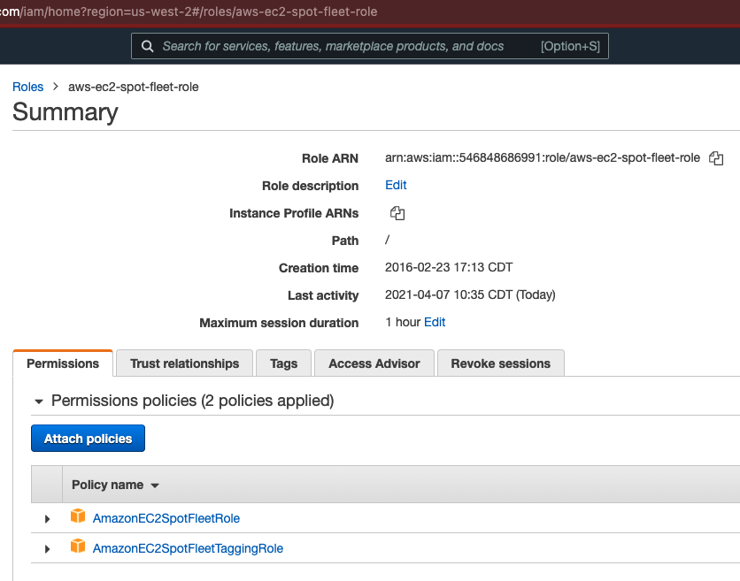

# Terraform for Launchpad

- [Terraform for Launchpad](#terraform-for-launchpad)
  - [What is it](#what-is-it)
  - [How to use it](#how-to-use-it)
    - [Prerequisites](#prerequisites)
    - [Deploy](#deploy)
    - [Teardown](#teardown)
  - [Try it out](#try-it-out)
  - [Tips and tricks](#tips-and-tricks)
    - [Making edits to Terraform configs](#making-edits-to-terraform-configs)
    - [How would I use Ansible here?](#how-would-i-use-ansible-here)

## What is it

This is based off the MCC (upstream Launchpad repo) of Launchpad, in particular the Terraform configuration files [located here](https://github.com/Mirantis/mcc/tree/master/examples/tf-aws). Note that the current state has changed considerably from that original MCC upstream copy.

The updates in this stack afford the user the ability to select between various OS platforms, such as:

- CentOS: 7
- Oracle Linux 7.x, 8.x
- RHEL: 7.x, 8.x, 9.x
- Rocky Linux: 8, 9
- SLES: various 12 and 15
- Ubuntu: 18.04, 20.04, 22.04
- Windows Server: 2019, 2022

**Note:** Just because the Terraform config supports it and builds it out, does _not_ necessarily mean that Launchpad will support it. Skew between tools (eg, terraform and launchpad) is not an uncommon event, although we make the effort to minimize this skew.

## How to use it

While it would be helpful to be familiar with [the steps provided in the MCC repository](https://github.com/Mirantis/mcc/blob/master/examples/tf-aws/README.md), here's what you need to know for this repo:

### Prerequisites

- Terraform executable
  - Mac users can just use Homebrew: `brew install terraform`
  - everyone can [download from here](https://www.terraform.io/downloads.html)

- `launchpad` executable
  - [grab the latest version from the MCC repo](https://github.com/Mirantis/mcc/releases) (v1.4.1 as of this writing)

- Ansible (optional, but handy)
  - [Setup instructions from elsewhere in this repo](../system_test_toolbox/ansible)

- AWS credentials
  - if a command such as `aws sts get-caller-identity` is successful (doesn't throw an authentication error) then you should be good to go

- AWS IAM EC2 spot fleet role

  _This only needs to be set **once** for all engineers, ie, infra bootstrap in a new IAM account_

    navigate to the `aws-ec2-spot-fleet-role` [here](https://console.aws.amazon.com/iam/home?region=us-west-2#/roles/aws-ec2-spot-fleet-role)
    ensure these policies are attached:
      `AmazonEC2SpotFleetRole`
      `AmazonEC2SpotFleetTaggingRole`
    screenshot of successful config:
      

### Deploy

`terraform` will use variables configured in one or more files, using the loading order [described on this page](https://www.terraform.io/docs/language/values/variables.html#variable-definition-precedence).

A brief overview:

> Terraform loads variables in the following order, with later sources taking precedence over earlier ones:
>
> - Environment variables
> - The `terraform.tfvars` file, if present.
> - The `terraform.tfvars.json` file, if present.
> - Any `*.auto.tfvars` or `*.auto.tfvars.json` files, processed in lexical order of their filenames.
> - Any `-var` and `-var-file` options on the command line, in the order they are provided. (This includes variables set by a Terraform Cloud workspace.)

If the filename doesn't match the above format, it will get ignored. Other than that, any file ending in `.tf` in the current working directory will be considered as Terraform HCL configuration. Unless a config file specifies a subdirectory (eg, module) to consider, all subdirs will be ignored.

In our case, most of the options you'll want or need to customize will belong in `terraform.tfvars`.

How we use these files:

- `terraform.tfvars` (root dir of terraform config)
  - put most/all of your local config options in this file; use `terraform.tfvars.example` for inspiration
- any other files ending in `.auto.tfvars` or `.auto.tfvars.json`
  - **Recommended:** create a separate file named `passwords.auto.tfvars` to hold your local password data, eg:

    ```text
    admin_password     = "abcd1234changeme"
    win_admin_password = "tfaws,,CHANGEME..Example"
    ```

**Notes:**

- variables of particular interest:
  - **NEW** `life_cycle` will let you specify `ondemand` or `spot` instance types (default: `ondemand`)
  - **NEW** `role_platform` is a map that will let you specify different linux platforms based on their role, eg:
  
    ```bash
    role_platform = {
        "manager" = "rhel_8.6"
        "worker"  = "rocky_8"
        "msr"     = "ubuntu_20.04"
    }
    ```

    - in the event of having configured both `platform` and `role_platform`, `role_platform` always wins
  - **NEW** `ssh_algorithm` will let you select either `RSA` or `ED25519` (default: `ED25519`)
  - `win_admin_password` tends to be finicky; if you're experiencing Windows deployment issues, start here (and ask the team)
  - `platform_name` popular choices include `rhel_8.4`, `rhel_8.6`, `ubuntu_20.04` - to see the full list, review [etc/platforms.json](etc/platforms.json).
  - `open_sg_for_myip` will add a SG rule which opens up your cluster to all ports/protocols from your IP (and only from your IP), in addition to the other minimalist SG rules; don't use this unless you have a need to access other ports (eg, troubleshooting, accessing a swarm or kube service you've created, etc)
  - `extra_tags` is a map of completely arbitrary and optional tags of your choosing that Terraform will attach to as many of your created resources as possible, eg:

    ```text
    extra_tags = {
      "ticket" = "TESTING-9999"
      "mood"   = "chill"
      "coffee" = "espresso"
      "music"  = "downtempo"
      "email"  = "hercule@example.com"
    }

- [variables.tf](variables.tf)
  - Config file with all of the requisite inputs for the root module
  - If you're not sure what variables you can set in `terraform.tfvars`, review (**DO NOT EDIT**) `variables.tf` for inspiration

- `*.tf`
  - these config files provide the configuration logic; don't edit unless you're working on a PR, or need to do a quick local hack
  - the prefixes for files such as `main.tf`, `variables.tf`, `outputs.tf` are arbitrary otherwise, and are named mainly for human convenience

- **Any** file ending in `.tf` will be seen by Terraform, so be mindful of any extra files you create in the root or any of the directories referenced by the root `*.tf` files

- Any file ending in `.auto.tfvars` (eg, `mystuff.auto.tfvars`) in the same dir as `terraform.tfvars` will be included. Handy for things like custom passwords.
  - Likewise for `.auto.tfvars.json` but must heed JSON formatting rules.

### Teardown

- `terraform destroy -auto-approve`
  - this is the "I'm done and I know what I'm doing here" approach, so make sure you're in the right directory before kicking it off

## Try it out

As long as you have the prerequisites installed, try running this command:

```bash
terraform apply -auto-approve
```

## Tips and tricks

### Making edits to Terraform configs

While making changes, don't spend time fussing over any crufty formatting, as Terraform has a nice helper feature for that.

At any time after making changes to any Terraform config files, run the following to tidy up the formatting (from the config root dir):

```bash
terraform fmt -write=false -recursive -diff
```

Most times you can probably just skip the `-write=false` and just let `fmt` DTRT:

```bash
terraform fmt -recursive -diff
```

If you don't even want to see the diff output (ie, quiet mode), drop the `-diff` as well.

You can run the `fmt` as often as you like. You can save it for the last step before doing your commit, if you prefer. This is purely for human readability.

### How would I use Ansible here?

Relevant files in the root dir of this repo:

- `ansible.cfg` - a baseline config file which Ansible will reference; among other things, it describes the default inventory file, which is as follows:
- `hosts.ini` - this is one of the files created by running terraform; do not check your `hosts.ini` into the repo
